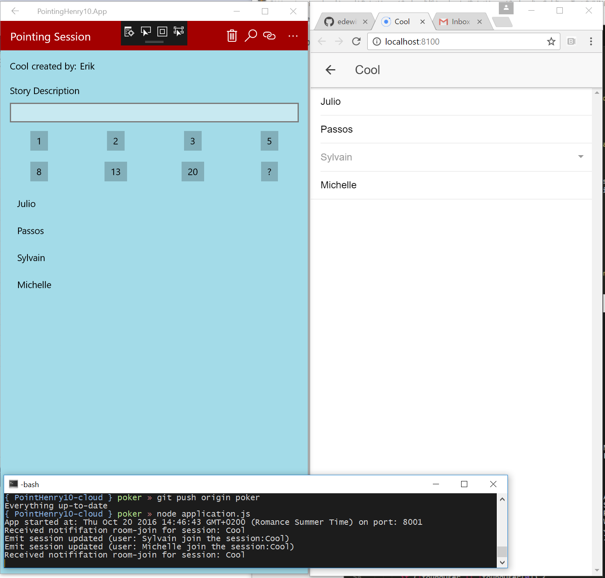

PointingHenry10
===============
Point poker app built with [Template10]()

# Development
* Run server locally, see [Pointing Poker cloud app](https://github.com/edewit/PointHenry10-cloud) 
* or modify `fhconfig.json` to point to your remote location. Remove `fhconfig.local.json.
* Open in VS and run
```
open PointingHenry10.sln
```

# Build and Run
* you can also install the [web app version](https://github.com/edewit/PointHenry-app)
